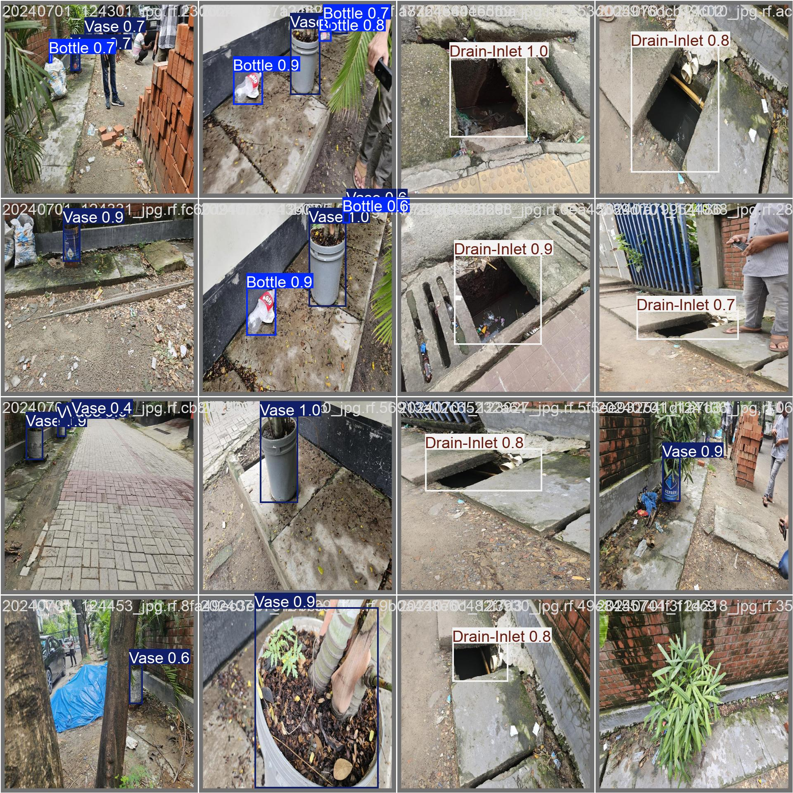
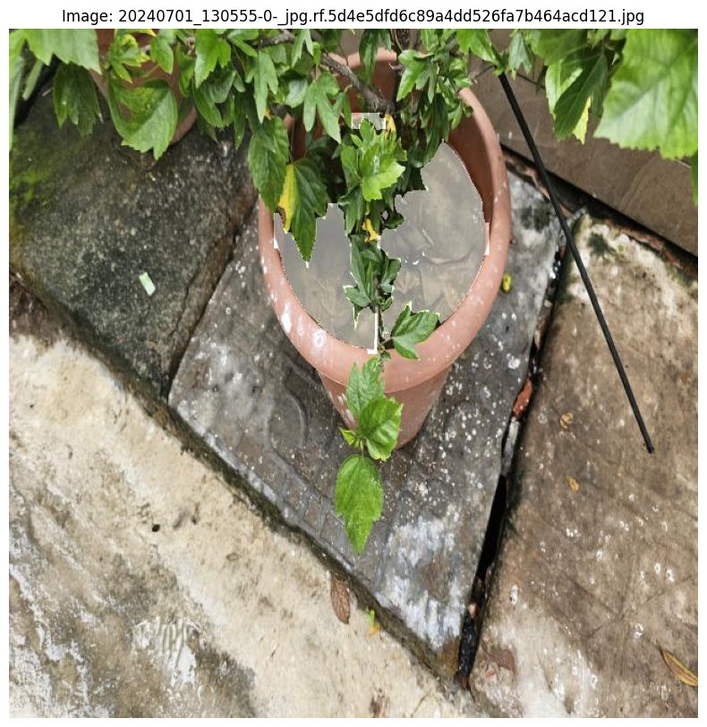

# MED-SAM: Mosquito Ecology Detection and Surface Segmentation Multi-class Dataset

<h2>Dataset Overview</h2>

<h3>Breeding Place Detection</h3>

<h3>Surface Segmentation</h3>

<h2>Access the Dataset</h2>

Explore the MosquitoFusion dataset on Kaggle: <a href="" target="_blank">MED-SAM</a>

<h2>Code</h2>

The notebook called <a href="Code/yolov5s_yolov8n_yolov9s_1.ipynb">yolov5s_yolov8n_yolov9s_1.ipynb</a> is used to train the models YOLOv5s, YOLOv8n, and YOLOv9s for mosquito breeding place detection with the MED-SSD Dataset. And the notebook called <a href="Code/Yolov8x-seg.ipynb">Yolov8x-seg.ipynb</a>.

<h2>License</h2>

This dataset is available under <a href="LICENSE">LICENSE</a>. Please review the license before using the dataset for your projects.

<h2>Cite</h2>

If you use the MED-SAM dataset for your research, please cite it as follows:

<pre>
</pre>

<h2>Contact</h2>

For inquiries or feedback, feel free to contact us at mislam221096@bscse.uiu.ac.bd, msayeedi212049@bscse.uiu.ac.bd

</body>
</html>
