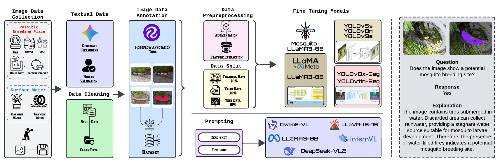
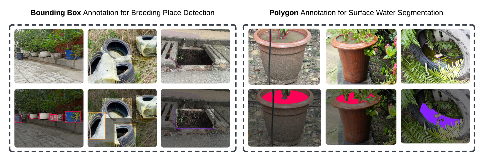

# VisText-Mosquito: A Unified Multimodal Benchmark Dataset for Visual Detection, Segmentation, and Textual Reasoning on Mosquito Breeding Sites

## [CVPR 2026 Workshop AI4RWC](https://sites.google.com/view/ai4rwc2026/home)

📄 <a href="https://arxiv.org/abs/2506.14629">**[paper]**</a> 📊 <a href="https://data.mendeley.com/datasets/rtsfh7jh7p/3" target="">**[dataset]**</a>

<h2>Abstract</h2>

_Mosquito-borne diseases pose a major global health risk, requiring early detection and proactive control of breeding sites to prevent outbreaks. In this paper, we present VisText-Mosquito, a multimodal dataset that integrates visual and textual data to support automated detection, segmentation, and reasoning for mosquito breeding site analysis. The dataset includes 1,828 annotated images for object detection, 142 images for water surface segmentation, and natural language reasoning texts linked to each image. The YOLOv9s model achieves the highest precision of 0.92926 and mAP@50 of 0.92891 for object detection, while YOLOv11n-Seg reaches a segmentation precision of 0.91587 and mAP@50 of 0.79795. For reasoning generation, we tested a range of large vision-language models (LVLMs) in both zero-shot and few-shot settings. Our fine-tuned Mosquito-LLaMA3-8B model achieved the best results, with a final loss of 0.0028, a BLEU score of 54.7, BERTScore of 0.91, and ROUGE-L of 0.85. This dataset and model framework emphasize the theme "Prevention is Better than Cure", showcasing how AI-based detection can proactively address mosquito-borne disease risks._

<h2>Dataset Overview</h2>

VisText-Mosquito is a comprehensive multimodal dataset designed to support detecting mosquito breeding sites, segmentation of water surfaces, and generating natural language reasoning for explainable AI applications. It consists of three core components:

1. **Breeding Place Detection:** This part includes 1,828 images with 3,752 annotations across five classes: Coconut-Exocarp, Vase, Tire, Drain-Inlet, and Bottle. The images were collected from diverse urban, semi-urban, and rural environments in Bangladesh under daylight conditions to ensure visual consistency. Detection performance was validated using state-of-the-art object detection models, including YOLOv5s, YOLOv8n, and YOLOv9s, with YOLOv9s achieving the highest mAP@50.

2. **Water Surface Segmentation:** This component contains 142 images with 253 annotations across two classes: Vase with Water and Tire with Water. YOLOv8x-Seg and YOLOv11n-Seg models were used to validate segmentation performance in detecting water surfaces within the identified containers.

3. **Textual Reasoning Generation:** Each image is linked with a natural language reasoning statement that explains the presence or absence of breeding risk. A fine-tuned BLIP model was used to generate these explanations, achieving strong performance on BLEU, BERTScore, and ROUGE-L metrics.

The VisText-Mosquito dataset offers a novel multimodal benchmark for training and evaluating AI models that combine detection, segmentation, and interpretability. It serves as a valuable resource for researchers and public health professionals aiming to develop explainable, scalable mosquito control solutions.

<h2>Code & Weights</h2>

<h2>Code</h2>

The notebook called <a href="Code/yolov5s_yolov8n_yolov9s_1.ipynb">yolov5s_yolov8n_yolov9s_1.ipynb</a> is used to train the models YOLOv5s, YOLOv8n, and YOLOv9s for mosquito breeding place detection. And the notebook called <a href="Code/Yolov8x-seg.ipynb">Yolov8x-seg.ipynb</a> is used to train the models YOLOv8x-seg for surface water segmentation.

<h2>Model Weights</h2>

The weight for object detection models are - <a href="Result/Yolov5s/Weight">YOLOv5s</a>, <a href="Result/Yolov5s/Weight">YOLOv8n</a>, and <a href="Result/Yolov5s/Weight">YOLOv9s</a>. The weight for segmentation model <a href="https://drive.google.com/drive/folders/1vjX6ZJbT87Xto4hQ7_dcueQjF9C5DjkI?usp=sharing">YOLOv8x-Seg</a>.

<h2>Cite</h2>

If you use the dataset for your research, please cite it as follows:

<pre>
@InProceedings{Islam_2026_CVPR,
    author    = {Islam, Md. Adnanul and Sayeedi, Md. Faiyaz Abdullah and Shuvo, Md. Asaduzzaman and Bappy, Shahanur Rahman and Rahman, Muhammad Ziaur and Islam, Md Asiful and Shatabda, Swakkhar},
    title     = {VisText-Mosquito: A Unified Multimodal Dataset for Visual Detection, Segmentation, and Textual Explanation on Mosquito Breeding Sites},
    booktitle = {Proceedings of the IEEE/CVF Conference on Computer Vision and Pattern Recognition (CVPR) Workshops},
    month     = {June},
    year      = {2026},
    pages     = {9165-9173}
}
</pre>

<h2>Contact</h2>

For inquiries or feedback, feel free to contact us at msayeedi212049@bscse.uiu.ac.bd, mislam221096@bscse.uiu.ac.bd
 

</body>
</html>
