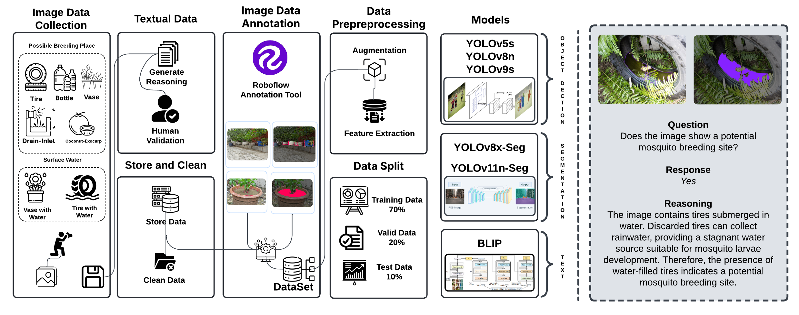

# VisText-Mosquito: A Multimodal Dataset for Mosquito Breeding Site Detection, Surface Segmentation, and Reasoning

<h2>Dataset Overview</h2>

VisText-Mosquito is a comprehensive multimodal dataset designed to support the detection of mosquito breeding sites, segmentation of water surfaces, and generation of natural language reasoning for explainable AI applications. It consists of three core components:

1. **Breeding Place Detection:** This part includes 1,828 images with 3,752 annotations across five classes: Coconut-Exocarp, Vase, Tire, Drain-Inlet, and Bottle. The images were collected from diverse urban, semi-urban, and rural environments in Bangladesh under daylight conditions to ensure visual consistency. Detection performance was validated using state-of-the-art object detection models, including YOLOv5s, YOLOv8n, and YOLOv9s, with YOLOv9s achieving the highest mAP@50.

2. **Water Surface Segmentation:** This component contains 142 images with 253 annotations across two classes: Vase with Water and Tire with Water. YOLOv8x-Seg and YOLOv11n-Seg models were used to validate segmentation performance in detecting water surfaces within the identified containers.

3. **Textual Reasoning Generation:** Each image is linked with a natural language reasoning statement that explains the presence or absence of breeding risk. A fine-tuned BLIP model was used to generate these explanations, achieving strong performance on BLEU, BERTScore, and ROUGE-L metrics.

The VisText-Mosquito dataset offers a novel multimodal benchmark for training and evaluating AI models that combine detection, segmentation, and interpretability. It serves as a valuable resource for researchers and public health professionals aiming to develop explainable, scalable mosquito control solutions.

<h2>Access the Dataset</h2>

Download the dataset From Mendeley Data: <a href="" target="">VisText-Mosquito</a>

<h2>Code</h2>

The notebook called <a href="Code/yolov5s_yolov8n_yolov9s_1.ipynb">yolov5s_yolov8n_yolov9s_1.ipynb</a> is used to train the models YOLOv5s, YOLOv8n, and YOLOv9s for mosquito breeding place detection. And the notebook called <a href="Code/Yolov8x-seg.ipynb">Yolov8x-seg.ipynb</a> is used to train the models YOLOv8x-seg for surface water segmentation.

<h2>Model Weights</h2>

The weight for object detection models are - <a href="Result/Yolov5s/Weight">YOLOv5s</a>, <a href="Result/Yolov5s/Weight">YOLOv8n</a>, and <a href="Result/Yolov5s/Weight">YOLOv9s</a>. The weight for segmentation model <a href="https://drive.google.com/drive/folders/1vjX6ZJbT87Xto4hQ7_dcueQjF9C5DjkI?usp=sharing">YOLOv8x-Seg</a>.

<h2>License</h2>

This dataset is available under <a href="LICENSE">LICENSE</a>. Please review the license before using the dataset for your projects.

<!-- <h2>Cite</h2>

If you use the MED-SAM dataset for your research, please cite it as follows:

<pre>
</pre> -->

<!-- <h2>Contact</h2>

For inquiries or feedback, feel free to contact us at mislam221096@bscse.uiu.ac.bd, msayeedi212049@bscse.uiu.ac.bd
 -->

</body>
</html>
